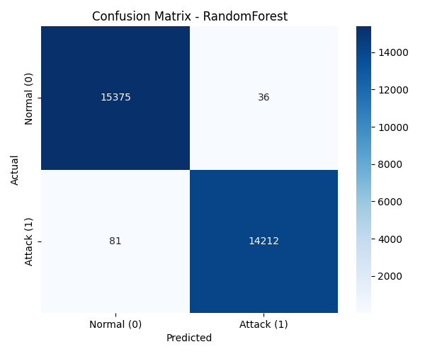
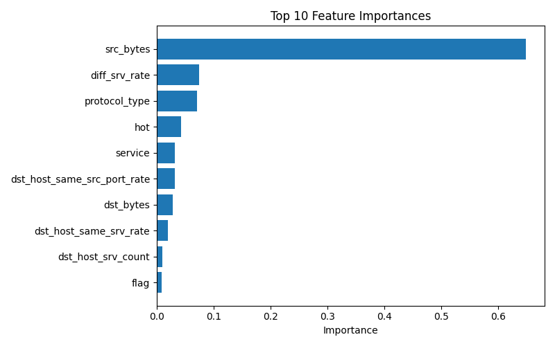

# Machine Learning-Based Intrusion Detection System (IDS)

An advanced Intrusion Detection System using machine learning to detect malicious network activity with high accuracy and low false positive rates. Built using the NSL-KDD dataset and multiple ML algorithms.




## 🛡️ Features

- **Multiple ML Models**: Comparative evaluation of Random Forest, Decision Tree, and Logistic Regression
- **High Detection Accuracy**: Random Forest achieves 99.61% accuracy
- **Low False Positive Rate**: Only 0.23% false alarms with Random Forest
- **Comprehensive Evaluation**: Full metrics analysis including Precision, Recall, F1-Score
- **Data Preprocessing Pipeline**: Advanced handling of NSL-KDD dataset challenges
- **Visual Analytics**: Confusion matrices and classification reports for each model

## 📊 Dataset

### NSL-KDD Dataset Overview
- **Source**: Refined version of KDD'99 dataset for IDS research
- **Records**: Labeled network connection records simulating cyber-attacks
- **Features**: 41 features including numerical and categorical attributes
- **Classes**: Normal traffic vs. various attack types (DoS, Probe, R2L, U2R)

### Dataset Challenges & Solutions
1. **Challenge**: Training and test sets contained different attack patterns
   - **Solution**: Merged datasets and performed 80-20 random split

2. **Challenge**: Categorical features (protocol, service, flag)
   - **Solution**: One-hot encoding for categorical variables

3. **Challenge**: Feature scaling requirements
   - **Solution**: Standardization of continuous features

## 🤖 Machine Learning Models

### Model Performance Comparison

| Model | Accuracy | Precision | Recall | F1-Score | False Positive Rate |
|-------|----------|-----------|--------|----------|---------------------|
| **Random Forest** | **99.61%** | **99.75%** | **99.43%** | **99.59%** | **0.23%** |
| Decision Tree | 99.49% | 99.43% | 99.50% | 99.47% | 0.53% |
| Logistic Regression | 95.62% | 96.46% | 94.37% | 95.40% | 3.21% |

### Key Performance Insights
- **Random Forest**: Best overall performer with excellent balance across all metrics
- **Decision Tree**: High accuracy with good interpretability
- **Logistic Regression**: Effective baseline model with reasonable performance
- **Critical Metric**: False Positive Rate (FPR) - Random Forest minimizes false alarms (0.23%)

## 🏗️ System Architecture

### Data Pipeline
```
Data Collection → Preprocessing → Feature Engineering → Model Training → Evaluation → Deployment
```

### Processing Steps
1. **Data Merging**: Combined train and test sets for consistent attack patterns
2. **Feature Encoding**: One-hot encoding for categorical variables
3. **Normalization**: StandardScaler for continuous features
4. **Train-Test Split**: 80% training, 20% testing (randomized)
5. **Model Training**: Multiple algorithms with hyperparameter tuning
6. **Evaluation**: Comprehensive metrics analysis

### Technologies Used
- **Programming Language**: Python 3.8+
- **ML Framework**: Scikit-learn
- **Data Processing**: Pandas, NumPy
- **Visualization**: Matplotlib, Seaborn
- **Environment**: Jupyter Notebook, Virtual Environment
- **Development**: PyCharm/VSCode

## 📈 Model Training & Evaluation

### Training Process
1. **Data Preparation**: Merged NSL-KDD train+test datasets
2. **Feature Engineering**: One-hot encoding, standardization
3. **Model Selection**: Multiple algorithms with grid search
4. **Cross-Validation**: 5-fold cross-validation for robustness
5. **Hyperparameter Tuning**: Optimized for accuracy and low FPR

### Evaluation Metrics
- **Accuracy**: Overall prediction correctness
- **Precision**: Accuracy of positive predictions
- **Recall**: Ability to detect all attacks
- **F1-Score**: Balance between precision and recall
- **False Positive Rate (FPR)**: Critical for reducing alert fatigue

### Model Selection Rationale
**Random Forest** was selected as the optimal model because:
- Highest accuracy (99.61%)
- Lowest false positive rate (0.23%)
- Best F1-Score (99.59%)
- Robustness to overfitting
- Feature importance analysis capability

## 🔍 Feature Importance Analysis

### Top Network Features for Intrusion Detection
Based on Random Forest feature importance:
1. **Service Type**: Different services have varying vulnerability profiles
2. **Protocol**: Connection protocol (TCP, UDP, ICMP)
3. **Duration**: Connection length
4. **Src Bytes**: Source to destination bytes
5. **Dst Bytes**: Destination to source bytes
6. **Flag**: Connection status flag
7. **Wrong Fragment**: Number of wrong fragments
8. **Urgent**: Number of urgent packets


### Dependencies (requirements.txt)
```txt
pandas==2.0.3
numpy==1.24.3
scikit-learn==1.3.0
matplotlib==3.7.2
seaborn==0.12.2
jupyter==1.0.0
notebook==6.5.4
joblib==1.3.1
```

## 📊 Results Analysis

### Key Findings
1. **Dataset Merging**: Critical step for model generalization
2. **Random Forest Superiority**: Best balance of all evaluation metrics
3. **Low FPR Importance**: Critical for production IDS to avoid alert fatigue
4. **Feature Engineering**: One-hot encoding significantly improved performance
5. **Model Interpretability**: Decision Tree provides insights into detection rules

### Performance Visualizations
- Confusion matrices for each model
- Classification reports with detailed metrics
- Feature importance plots
- Model comparison charts
- ROC curves and precision-recall curves

## 🎯 Practical Applications

### Use Cases
1. **Enterprise Network Security**: Real-time traffic monitoring
2. **ISP Monitoring**: Large-scale network anomaly detection
3. **Research & Development**: Baseline for new IDS algorithms
4. **Security Training**: Educational tool for cybersecurity students
5. **SIEM Integration**: Machine learning component for security platforms

### Deployment Considerations
1. **Real-time Processing**: Model inference speed requirements
2. **Scalability**: Handling high-volume network traffic
3. **Model Retraining**: Periodic updates for new attack patterns
4. **Alert Management**: Integration with existing security workflows
5. **False Positive Handling**: Threshold tuning for operational environment

## 🔬 Future Enhancements

1. **Deep Learning Models**: LSTM/CNN for temporal pattern detection
2. **Real-time Detection**: Streaming data pipeline implementation
3. **Ensemble Methods**: Combining multiple models for improved accuracy
4. **Anomaly Detection**: Unsupervised learning for zero-day attacks
5. **Cloud Deployment**: AWS/GCP/Azure integration
6. **API Development**: REST API for easy integration
7. **Dashboard Interface**: Real-time monitoring dashboard
8. **Alert System**: Automated alerting and response mechanisms
9. **Multi-dataset Training**: Incorporate CIC-IDS, UNSW-NB15 datasets
10. **Explainable AI**: Model interpretability for security analysts

## 📚 References & Resources

### Academic Papers
- Tavallaee, M., et al. "A detailed analysis of the KDD CUP 99 data set." (2009)
- Shiravi, A., et al. "Toward developing a systematic approach to generate benchmark datasets for intrusion detection." (2012)
- Breiman, L. "Random Forests." Machine Learning (2001)

### Datasets
- NSL-KDD Dataset: https://www.unb.ca/cic/datasets/nsl.html
- UCI KDD Archive: https://kdd.ics.uci.edu/databases/kddcup99/kddcup99.html

### Tools & Libraries
- Scikit-learn Documentation: https://scikit-learn.org/
- Pandas Documentation: https://pandas.pydata.org/
- Matplotlib Documentation: https://matplotlib.org/

## 🤝 Contributing

We welcome contributions to improve this Intrusion Detection System!

### How to Contribute
1. Fork the repository
2. Create a feature branch (`git checkout -b feature/Improvement`)
3. Commit your changes (`git commit -m 'Add some feature'`)
4. Push to the branch (`git push origin feature/Improvement`)
5. Open a Pull Request

### Contribution Areas
- New ML models and algorithms
- Performance optimizations
- Additional evaluation metrics
- Visualization improvements
- Documentation enhancements
- Bug fixes and code cleanup

## 📝 License

This project is licensed under the MIT License - see the [LICENSE](LICENSE) file for details.

## 👤 Author

**Damilola Oladoke**
- GitHub: [@oladokedamilola](https://github.com/oladokedamilola)
- LinkedIn: [Damilola Oladoke](https://linkedin.com/in/oladokedamilola)
- Portfolio: [damilolaoladoke.com](https://github.com/oladokedamilola/portfolio.html)


## 🙏 Acknowledgments

- NSL-KDD dataset creators and maintainers
- Open-source machine learning community
- Cybersecurity researchers and practitioners
- Academic advisors and mentors
- Open-source library developers (Scikit-learn, Pandas, etc.)

---

**⚠️ Security Disclaimer:** This system is for research and educational purposes. Always implement multiple layers of security in production environments and consult with cybersecurity professionals for critical infrastructure protection.
```